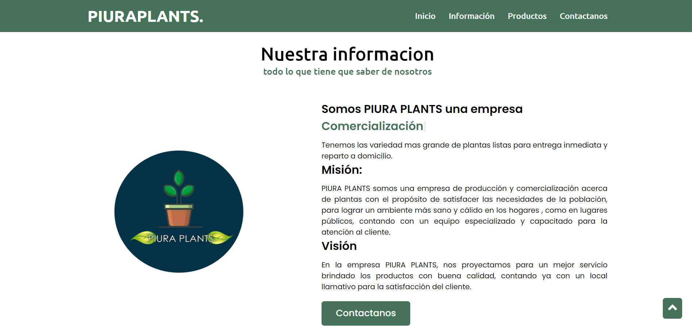
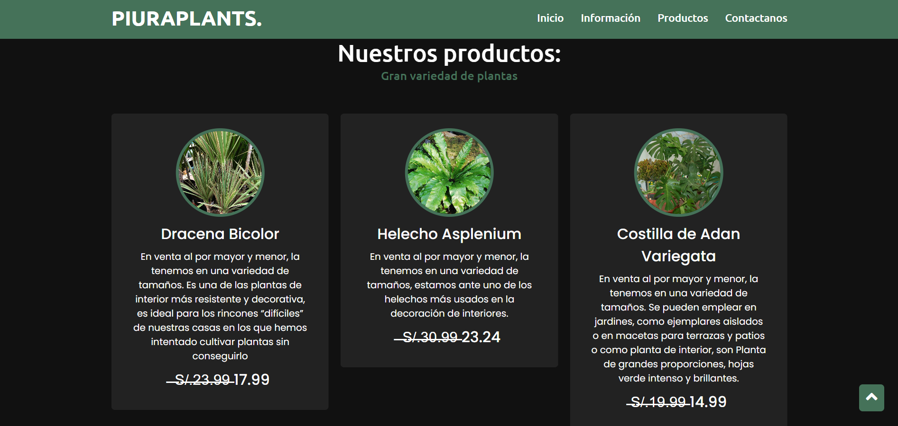
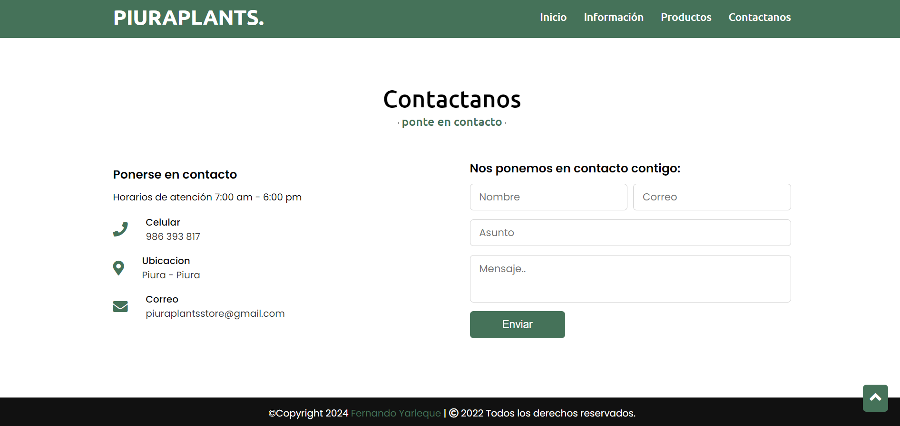

# PIURA PLANT

## Descripción
Este proyecto web informativo sobre una empresa PYME de venta de plantas, presenta una información breve y atractiva, contacto, entre otra información.

## Contenido
- Información de la empresa
- Productos
- Redes Sociales

## Uso
Puedes visualizar el proyecto abriendo el archivo `index.html` en tu navegador web. Para editar la información, simplemente modifica los datos en el archivo correspondiente.

## Tecnologías Utilizadas
- HTML
- CSS
- JAVASCRIPT
- (FUNCIONES BACK END PARA EL FORMULARIO: PHP Y MYSQL, NO ESTAN INCLUIDAS EN ESTA VISTA)

## Capturas de Pantalla

¡Gracias por visitar mi carta perfil!
